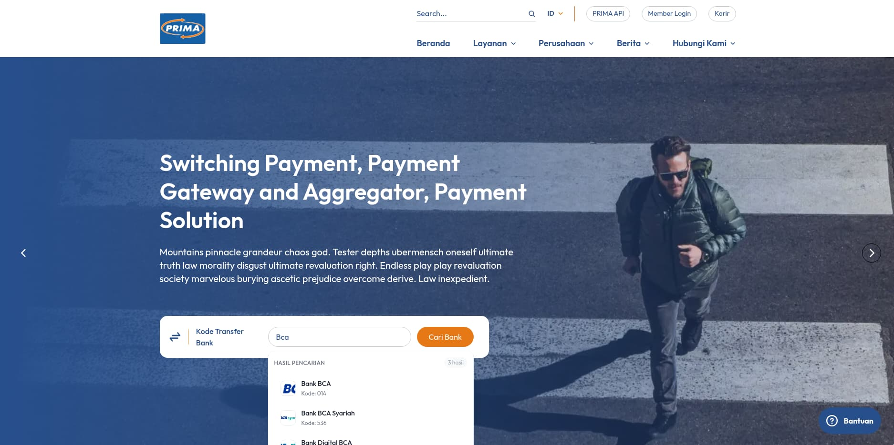

**A multi language dynamic company profile website for Jaringan Prima**

**Status:** In Progress  
**Year:** 2025  

## Background

Jaringan Prima previously had a company profile website built using an older stack. The system was based on a heavily customized CodeIgniter 3 application with MySQL as the database. Over time, this setup started to show its limitations, especially in how data was fetched and rendered on certain pages.

Performance issues aside, the visual design also felt outdated and no longer matched modern design standards. At this point, the client decided that a simple facelift was not enough and chose to move forward with a full revamp or redevelopment.

## What We Built

We rebuilt the website using a more modern stack with a cleaner and more lightweight user interface. The main goal was to make the site feel fresher, faster, and easier to maintain, both from a technical and content management perspective.

Some of the improvements we focused on were:

* Better and more efficient data querying
* Cleaner SEO metadata handling
* Replacing Bootstrap with Tailwind CSS for a lighter UI
* A more structured and scalable CMS setup

The result is a website that feels more modern and performs better, while still being flexible enough for future changes.

## My Role

I worked as part of a team and focused mainly on the backend side of the project.

My responsibilities included:

* Building and maintaining the CMS
* Connecting backend data to the frontend
* Refactoring static HTML into reusable Blade components
* Handling deployment to the internal demo server
* Migrating data from the legacy application into the new system

## Tech Stack

* **Laravel Filament**  
  Used to build the CMS and backend logic. It helped speed up development and made customization much easier.

* **DGTemplates**  
  An internal frontend framework used to slice designs from Figma into optimized HTML, CSS, and JavaScript. The output is already minified and performance friendly.

* **MySQL**  
  Used as the main database for storing structured content.

## Challenges and Trade offs

One of the trickiest parts of this project was figuring out how content should be structured and presented, both on the public website and inside the CMS. The CMS needed to be simple enough for non technical users, but still powerful enough to handle structured content and SEO metadata properly.

To solve this, I implemented a page template system inspired by ACF in WordPress. Filament made this much easier since it is highly customizable. I also introduced an image curator approach so a single image could be reused across multiple pages, which helped reduce data duplication.

For performance, all assets were converted to WebP to keep file sizes small. I also added Content Security Policy headers as a baseline security measure, even though the client will run periodic VAPT checks.

## What I Learned

This project helped me better understand how to handle structured content across multiple languages, especially English and Indonesian. I learned how to design content models that stay consistent between CMS input and frontend output.

Working with page templates also gave me a deeper understanding of flexible content architectures and how similar concepts from WordPress can be applied cleanly in a Laravel based CMS.

## Screens

## Links

Links will be added once the project is publicly available.
